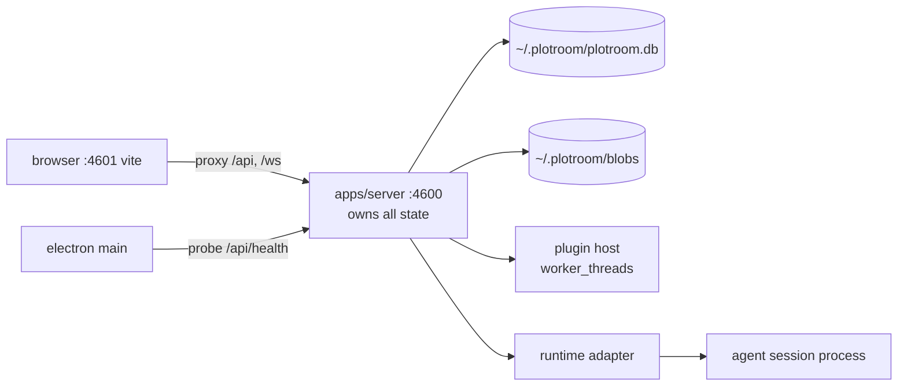

# PlotRoom

A **context-authoring canvas for operating a fleet of AI agents**. One operator
composes context — tickets, pull requests, documents, files, notes, and the
outputs of prior agent work — as a spatial node graph, wires that context into
commands, and runs any number of agent sessions against it at once.

It serves two tempos of the same act:

- **Authoring, at rest.** Compose what an agent will work from, deliberately,
  before anything runs. Wire a whole multi-stage topology — this command's output
  feeding that command's input — before spending a cent.
- **Steering, in flight.** A dozen sessions running at once: see the whole field,
  know which one needs you, answer it in five seconds, redirect any of them
  without re-reading a transcript first. This is the originating problem, and the
  product is judged against it.

Steering _is_ authoring at a faster tempo, so every mid-flight intervention
becomes content on the graph and the graph stays a complete record of what every
agent knows.

**It is not a workflow builder.** No triggers, no schedules, no conditional
branches, no loops — the agent is better at conditionals than a graph is. Edges
mean exactly two things: _this content is in that prompt_ (context) and _this run
produced that thing_ (provenance). Local-first, single operator, no accounts.
[`docs/product-spec.md`](docs/product-spec.md) is the definitive statement of
behavior; its §2 (twelve governing principles) and §14 (non-goals) are binding.

## Status

Past the first cut and landing continuously: the server, canvas, persistence,
plugin host and session sidecar all exist, and no release is tagged yet. Two
things are worth knowing before you run it:

- The default session runtime adapter is `pi-coding-agent`, which spawns a
  foreign `pi` process (`apps/server/src/runtime/pi.ts`).
- The in-repo sidecar adapter (`omp-session-host`) is **opt-in and unfinished** —
  it does not yet enforce permissions, so it refuses every verb that would
  produce a live session (`apps/server/src/runtime/index.ts`).

## Quick start

Requires **Node ≥ 22.18** and **pnpm 9**. `apps/session-host` additionally needs
**Bun ≥ 1.3.14** (it embeds a Bun-only agent SDK — see
[`docs/decisions/0005-bun-in-the-stack.md`](docs/decisions/0005-bun-in-the-stack.md));
without Bun on `PATH` the rest of the workspace still builds, typechecks and
tests, and only that package's `test` fails.

```sh
pnpm install
pnpm dev
```

`pnpm dev` builds the workspace graph once, then starts two watchers: the Hono
server on **127.0.0.1:4600** (HTTP _and_ WebSocket on the same port) and Vite on
**4601**, which proxies `/api` and `/ws` to the server so the browser sees one
origin. Open **http://localhost:4601**.

To run actual work, point the server at a checkout to branch workspaces from (or
at a remote to clone, `PLOTROOM_WORKSPACE_REMOTE`). With neither, a run is
refused, by design:

```sh
PLOTROOM_WORKSPACE_REPO=~/some-repo pnpm dev
```

The desktop shell is the same renderer in an Electron window. It has no `dev`
task, so build what it loads first; it then attaches to a server already
listening on `PLOTROOM_PORT`, or spawns one:

```sh
pnpm build
pnpm --filter @plotroom/desktop start
```

Serving the built renderer from the server alone (no Vite) works too: `pnpm build`
then run `apps/server`, and the server serves `apps/web/dist` on 4600. If that
directory is missing it says so — a 503 naming the path, never a blank page.

## Layout

pnpm workspaces + Turborepo. Everything is TypeScript with `strict` on, ESM-only,
private, linked `workspace:*`.

| Package               | Is                                                                            |
| --------------------- | ----------------------------------------------------------------------------- |
| `apps/server`         | Hono HTTP + WS; **the single owner of all state**                             |
| `apps/web`            | the renderer, served by the server and loaded by the desktop shell            |
| `apps/desktop`        | Electron main; spawns or attaches to a server, local or remote                |
| `apps/session-host`   | one agent session per process (Bun); the only package embedding a vendor SDK  |
| `packages/core`       | the domain and its rules — graph, runs, sessions, workspaces, claims, budgets |
| `packages/db`         | Drizzle schema, migrations, per-subsystem stores, FTS5 search                 |
| `packages/ui`         | canvas (xyflow) and panels (React)                                            |
| `packages/plugin-sdk` | the plugin contract and its `worker_threads` host                             |
| `packages/plugins/*`  | in the box: `filesystem`, `git`, `github`, `jira`                             |



The renderer is one web app: desktop and browser are two ways to load it, never
two forks. No client code holds a host or port — every data source calls relative
`/api/...` paths.

## What exists today

- **Rules are predicates in `@plotroom/core`, called by every surface** — the
  canvas, the API and agent tools refuse identically. `checkConnection` (legal
  edges), `wouldCycle` (command acyclicity), `checkAuthoring` (no session authors
  into its own chain), `isCompactable` / `isRunCompactable` (retention).
- **Persistence**: 51 declared tables and 31 migrations covering objects and
  versions, the graph, workstreams, commands and runs, sessions and their
  observation log, claims and the write ledger, spend and budgets, steering,
  approvals, attention and outbound routes, integrations, plugins, standing
  instructions and settings. Content ≤ 64 KiB stays inline; larger spills to a
  content-addressed blob tree. Search is FTS5.
- **Server**: 26 route modules under `/api` and exactly one WebSocket at `/ws`
  (no replay — a client resyncs through `GET /api/snapshot`).
- **Canvas**: rigid-body push, collapsing containers, zoom-level semantics,
  mid-drag refusal of illegal edges, undo, durable arrangement (the server, not
  `localStorage`, owns node position). Nodes are DOM-based on purpose — that is
  what makes them keyboard-reachable.
- **Panels**: conversation, stop controls, attention queue, what-changed, fleet,
  timeline, diff, search, settings, logs, notes, graph warnings, plugin health —
  plus a command palette and a shortcuts overlay driven by the binding registry,
  so a binding cannot exist undocumented.
- **Plugins**: `git` contributes the only workspace kind that ships; `github` and
  `jira` contribute concept producers, write actions, agent tools and world
  conditions; `filesystem` is read-only.

## Configuration

Everything durable lives in one portable directory, `~/.plotroom` by default:
`plotroom.db` plus a `blobs/` tree. Beside them sit derived directories a full
reset removes — `git-cache/`, `runtime/`, and `workspaces/`, which is
relocatable.

The state directory is the one thing that can only come from the environment
(the store that would hold the override lives inside it). Everything else
configurable is a setting, and environment variables supply only its default.
Log level, concurrency limit, the tick intervals, the credential and the trusted
origins apply live; the bind address and port, the static directory, the runtime
adapter and workspace provisioning take effect on the next start. The settings
catalog ([`apps/server/src/settings/catalog.ts`](apps/server/src/settings/catalog.ts))
says which is which, and why — so no surface has to guess what a write just did.

| Variable                           | Default              | Purpose                                         |
| ---------------------------------- | -------------------- | ----------------------------------------------- |
| `PLOTROOM_STATE_DIR`               | `~/.plotroom`        | the portable state directory                    |
| `PLOTROOM_PORT` / `PLOTROOM_HOST`  | `4600` / `127.0.0.1` | HTTP + WS bind (Vite dev takes `PORT + 1`)      |
| `PLOTROOM_CREDENTIAL`              | unset                | operator bearer credential                      |
| `PLOTROOM_ALLOW_NON_LOOPBACK_BIND` | `false`              | required, with a credential, to leave loopback  |
| `PLOTROOM_STATIC_DIR`              | `apps/web/dist`      | the built renderer to serve                     |
| `PLOTROOM_WORKSPACE_REPO`          | unset                | checkout to branch workspaces from              |
| `PLOTROOM_WORKSPACE_REMOTE`        | unset                | remote to clone when there is no checkout       |
| `PLOTROOM_RUNTIME`                 | `pi-coding-agent`    | session runtime adapter                         |
| `PLOTROOM_CONCURRENCY_LIMIT`       | `4`                  | concurrent sessions before the queue holds work |
| `PLOTROOM_LOG_LEVEL`               | `info`               | `debug` \| `info` \| `warn` \| `error`          |

That is the operator subset; `loadServerConfig` in
[`apps/server/src/config.ts`](apps/server/src/config.ts) is the complete list,
including workspace provisioning, tick intervals and runtime program paths.

Bound to the local machine by default — remote access is expected to be
tunnelled, and a non-loopback bind refuses to start without both the opt-in and a
credential. The desktop shell can also connect to a remembered **remote backend**
instead of starting its own, in which case workspaces and diffs refer to that
machine. See [`docs/deployment.md`](docs/deployment.md).

## Verifying a change

```sh
pnpm verify                            # the checks CI's verify job runs
pnpm build                             # tsc -b across the project graph
pnpm --filter @plotroom/web e2e        # Playwright gates (needs pnpm build first)
```

Vitest everywhere except `apps/session-host`, which runs `bun test`. The
Playwright suite is deliberately outside `verify` — each of its 13 specs spawns a
real server and a real git repo — so CI runs it as its own job, and locally you
run it when you touch a surface it covers: canvas behavior, steering, triage
across restart, keyboard access, search/settings/logs.

Green `verify` proves nothing broke — not that what you built works. Exercise the
change itself as well.

## Contributing

Read [`CONTRIBUTING.md`](CONTRIBUTING.md) for the git-level detail and
[`AGENTS.md`](AGENTS.md) for the canonical conventions; `AGENTS.md` wins on any
conflict. The short version: work in a worktree on a topic branch, never on
`main`, and never by switching the primary checkout's branch. Several agents and
the operator work in this repository at the same time, so a worktree you did not
create is not yours to write in.

Work tracking lives outside this repository. The only in-repo record of work is
[`CHANGELOG.md`](CHANGELOG.md), generated from the commit range at release time.

## Where to read next

| Document                                                   | Answers                                                |
| ---------------------------------------------------------- | ------------------------------------------------------ |
| [`docs/product-spec.md`](docs/product-spec.md)             | what the product does — behavior, never implementation |
| [`docs/architecture/`](docs/architecture/)                 | why each subsystem is shaped as it is                  |
| [`docs/decisions/`](docs/decisions/)                       | decision records, with the reasoning that survived     |
| [`docs/plugin-contract.md`](docs/plugin-contract.md)       | what a plugin may contribute, and its trust boundary   |
| [`docs/attention-contract.md`](docs/attention-contract.md) | how the queue derives what needs you                   |
| [`docs/deployment.md`](docs/deployment.md)                 | packaging, updates, remote backends, backup            |

Four things in the spec are schema-shaped rather than feature-shaped, and every
change touching schema is judged against them (spec §15): run history records the
full assembled content and configuration; every context edge records its author;
version retention follows the compaction rule; outputs are addressed per run as
`output@n`, with `latest` a special case of it.

## License

Private and unlicensed. All rights reserved.
