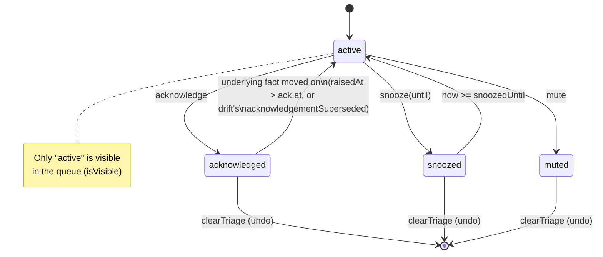

# PlotRoom — Attention Derivation

**Scope.** The attention system's implementation reference (spec §7): where the one computation lives, what each feed carries, how ranking and triage work, the complete health-alert catalog, and how outbound routing turns the same derivation into webhook deliveries. The phases and plans that feed it live in [session-lifecycle](session-lifecycle.md); the persisted records live in [data-model](data-model.md). Describes the code as it stands, including its known gaps (#197, #289) and one open direction (#137).

---

## 1. One derivation, many surfaces

Everything the operator can see about what wants attention — a node's badge, an off-screen marker, the header count, the window title, the application badge, a system notification, an outbound webhook — is a rendering of **one ranked list**, computed once. Nothing downstream of it re-ranks, re-filters, or keeps a second copy of what has been triaged. That rule has two halves, each living in its own package:

- **`packages/core/src/attention/derive.ts`** is the pure shaping function. `deriveAttention(sources, context)` takes the six feeds (`AttentionSources`) and a context (`{ now, triage }`), builds one `DerivedAttentionItem` per fact, and calls `visibleAttention` to apply the triage ledger and sort. `attentionItems()` strips the result down to `AttentionItem[]`, which is what every in-app surface actually consumes; the router (§6) reads the fuller `DerivedAttentionItem`, because it needs `states` too.
- **`apps/server/src/attention/service.ts`** (`AttentionService`) is the one place that _calls_ it. It joins the stores — sessions, questions, approvals, drift, integrations, claims, broadcasts — into `AttentionSources`, hands them to `deriveAttention`, and is the only class in the server that does this join. `derive()` returns the ranked, triaged list; `items()` is what `GET /api/attention` and every other reader use; `refresh()` re-derives, diffs the previous emission against the new one by item id, and publishes `attention` `created`/`updated`/`deleted` events on the bus — the one event stream every other surface (queue, node badges, outbound routes) subscribes to.

`AttentionService` re-derives on two triggers, both **reads, never initiations** (`docs/product-spec.md` principle 2): the event bus (`subscribe()`, filtered to `TRIGGERING_ENTITIES` — session, question, approval, claim, claim_wait, claim_policy, broadcast, run, version, object, session_transcript, integration — deliberately not every event, since a streaming delta changes nothing a queue row renders), and a slow tick (`apps/server/src/attention/tick.ts`, `startAttentionTick`) for the two facts that are true only because time passed: a threshold coming due (idle, spinning, unanswered, blocked-on-you) and a snooze elapsing. The tick "starts nothing and spends nothing — it reads state and publishes a list"; setting its interval to zero disables punctuality, not the derivation (every event and every `GET /api/attention` still re-derives).

**Hiding is the source's job.** `visibleAttention` filters muted and (still-)snoozed items out before anything is emitted, and no surface holds a ledger of its own to re-filter with — this is the attention contract's normative rule, stated in `packages/core/src/attention/types.ts`'s module doc as the reason a second computation of "what needs attention" would be a failure of the peer-surfaces principle (product-spec principle 8) in the surface the operator trusts most.

## 2. The feeds

`ATTENTION_FEEDS` (`packages/core/src/attention/types.ts`) names exactly six kinds, and `deriveAttention` builds one row-shaping function per feed (`derive.ts`'s `approvalRow`, `questionRow`, `healthRow`, `completionRow`, `driftRow`, `broadcastRow`). Every row carries `id`, `feed`, `target` (`{ nodeId, workstreamId, sessionId? }`), `rank`, `summary`, `payload`, `raisedAt`, and `snoozeUntil` — the `summary` is written so the row answers **without opening anything** (§7.1).

| Feed         | Source                                                                | Id                                              | What the row carries                                                                                                                                                                                                                                                                                        |
| ------------ | --------------------------------------------------------------------- | ----------------------------------------------- | ----------------------------------------------------------------------------------------------------------------------------------------------------------------------------------------------------------------------------------------------------------------------------------------------------------- |
| `question`   | An unanswered `SessionQuestion`                                       | `question:<questionId>`                         | `${sessionId}: ${text}`, plus `options` verbatim (`id` + `label`) so a surface can answer inline without a label→id lookup.                                                                                                                                                                                 |
| `approval`   | A pending `ApprovalAttention`, **or** one whose granted effect failed | `approval:<id>` / `approval:<id>:effect-failed` | The ask's own sentence; `capability` (the tool name, or the ask kind for a claim); `answers` (empty for the effect-failure row, which asks for no decision); `effectFailure` (non-null only on that row). Two distinct items, never both live for one approval at once.                                     |
| `drift`      | A `DriftFlag` from `deriveBoardDrift`                                 | `drift:<consumer>:<objectId>` (`driftItemKey`)  | A one-line "what changed" sentence (direct vs. transitive cause), `objectId`, and `changedSummary`. Also sets `acknowledgementSuperseded` — the version-based baseline check (§4) — since drift is the one feed whose fact is a state, not an event.                                                        |
| `health`     | A `HealthAlert` (§5)                                                  | `health:<alert>:<subject>`                      | Just `{ kind: "health", alert }` — the alert kind. The row's `summary` is the alert's own sentence, worded by `health.ts`.                                                                                                                                                                                  |
| `completion` | A finished session (`SessionEnd`)                                     | `completion:<sessionId>`                        | `${sessionId} ${describeEnd(end)}` — a plain-English account of how it ended (completed and proven, failed with its message, out-of-budget, interrupted, stopped, ended-by-user).                                                                                                                           |
| `broadcast`  | A session-originated `BroadcastAttention`                             | `broadcast:<broadcastId>`                       | `${sender} broadcast to N sessions: ${category}` — **deliberately not the broadcast's own text.** The category and reach are what the row is for; the operator is told a broadcast happened, not handed the content to read (redaction happens at the source, before §6's outbound whitelist ever sees it). |

**Completion and broadcast are bounded history windows, not unanswered work.** Every other feed persists until the fact itself resolves or is triaged; completion and broadcast instead expire on a clock. `AttentionService`'s `completionSources()` and `broadcastSources()` (`apps/server/src/attention/service.ts`) only include a session end or a broadcast whose timestamp is within `completionWindowSeconds` / `broadcastWindowSeconds` of now — both default to `24 * 60 * 60` (24 hours) in `DEFAULT_ATTENTION_CONFIG`. Past that window a session's completion is history the session card still shows, not attention: "a completion nobody triaged a day later is history, not attention — the record is still there." Broadcast sourcing additionally: dedupes by `broadcastId` across workstreams (a broadcast can touch several), skips the operator's own broadcast (not reported back to its sender), and requires `origin === "session"` (an operator broadcast never becomes an attention row about itself, §6.5).

Four of the six feeds carry a `sessionId` on their target and are hidden the moment that session is deleted (`AttentionService.sources()`'s `onTheBoard` filter, issue #77) — questions, approvals, health, and completions. Drift and broadcast are deliberately **not** filtered this way: drift names no session at all (it is about a consumer node and an object), and a broadcast is a fact about what was said, which deleting the sender does not un-say.

## 3. Item states and ranking

`AttentionItem.rank` (a number, lower sorts first) is assigned once, in `derive.ts`, and no surface recomputes it (§7.1: "a surface only ever orders by it"). `ATTENTION_RANKS`:

| Rank                      | Value | Rows                                                                    |
| ------------------------- | ----- | ----------------------------------------------------------------------- |
| `approval`                | 0     | Every approval row (ask or effect-failure)                              |
| `question`                | 100   | Every question row                                                      |
| `blockedHealth`           | 200   | Health alerts `blocked-on-you` and `unanswered`                         |
| `wantsDecisionCompletion` | 300   | A completion whose end wants a decision (failed, or otherwise unproven) |
| `otherHealth`             | 400   | Every other health alert                                                |
| `drift`                   | 500   | Every drift row                                                         |
| `completion`              | 600   | A completion that does not want a decision                              |
| `broadcast`               | 700   | Every broadcast row                                                     |

The ordering encodes what blocks whom: an approval or a question holds a _session_ still until the operator answers, so they lead; a session waiting on the operator is the same stall from the other side (`blocked-on-you`, `unanswered`); a completion that did not prove what it set out to do wants a decision and outranks drift, which is true but not urgent; a proven completion and a broadcast are the operator being _told_ something rather than asked, so they are last — the rows a busy queue is allowed to leave for later.

`visibleAttention` (`derive.ts`) sorts the visible set by `rank`, then `raisedAt`, then `id` (a stable tie-break, so re-derivation never reorders two items that tied on both).

A second, orthogonal vocabulary — `ATTENTION_STATES`: `blocked`, `failed`, `wants-decision`, `anything` — is what an outbound route (§6) matches against. It is computed alongside each item as `DerivedAttentionItem.states`, not read off the item itself, because two of the four states are not recoverable from the item alone: a completion's outcome is not in its payload (there is nothing left to _answer_ about a finished session, so the payload doesn't carry it), and "blocked" is a fact about the session, not about the row's content.

## 4. The triage state machine

Every row supports the same three verbs, for every feed, because "without triage verbs the queue becomes the inbox you cannot clear" (`docs/product-spec.md` §4.5):

- **acknowledge** — seen; the consumer's baseline advances. No side effect beyond bookkeeping (principle 2: acknowledging never starts anything).
- **snooze** — hidden until a named return time. There is no snooze-forever; the API (`apps/server/src/routes/attention.ts`'s `triageBody`) rejects a snooze with no `snoozedUntil`, and the service (`AttentionService.triage`) rejects one whose `snoozedUntil` is not strictly in the future.
- **mute** — never show this occurrence again, until explicitly undone.

`packages/core/src/sessions/triage.ts` is the one place the rule lives. A `TriageRecord` is `{ verb, at, by, baselineVersionId, snoozedUntil }`; `triageStatus(record, now)` maps it to `active | acknowledged | snoozed | muted` (a snooze whose `snoozedUntil` has elapsed reads back as `active`); `isVisible(status)` is `status === "active"`. `applyTriage`/`clearTriage` are pure ledger operations over a `TriageLedger` (`ReadonlyMap<itemId, TriageRecord>`).



**Edge-trigger discipline.** `visibleAttention` does not simply hide anything with a record: an **acknowledgement covers only the occurrence it was made about**. For most feeds that means comparing time — a row whose `item.raisedAt` is _after_ the recorded acknowledgement's `at` is a new occurrence and is shown again (a session went idle, was acknowledged, then went idle a second time). Drift is the one feed that can answer this exactly rather than approximately: because a drift flag is a state about _versions_ rather than a moment, `derive.ts` reads `acknowledgementSuperseded` off the `DriftAttentionSource` (computed once, in `deriveBoardDrift`/`triage.ts`'s `acknowledgementSuperseded`, by comparing the acknowledgement's recorded `baselineVersionId` against the object's latest version) instead of comparing timestamps — an edit landing in the same second as the acknowledgement would be indistinguishable by time and is not ambiguous at all by version. A snoozed item is simply absent from the derivation while `now < snoozedUntil`; the instant it elapses it returns with `snoozeUntil: null` (never a stale non-null value, which would be indistinguishable from still being hidden).

**What persists: `attention_triage`.** One ledger for every feed (`packages/db/src/schema.ts`, `packages/db/src/migrations.ts`), keyed by the item's own stable id rather than one table per feed:

```sql
CREATE TABLE attention_triage (
  item_id             TEXT NOT NULL,
  consumer            TEXT NOT NULL,
  verb                TEXT NOT NULL CHECK (verb IN ('acknowledge', 'snooze', 'mute')),
  at                  INTEGER NOT NULL,
  by_kind             TEXT NOT NULL CHECK (by_kind IN ('human', 'session')),
  by_session          TEXT,
  baseline_version_id TEXT,
  snoozed_until       INTEGER,
  PRIMARY KEY (item_id, consumer),
  CHECK (verb IS NOT 'snooze' OR snoozed_until IS NOT NULL),
  CHECK ((by_kind = 'session') = (by_session IS NOT NULL))
);
```

`consumer` is who triaged — today always the operator's fixed id (`OPERATOR_CONSUMER`), with the column already shaped for a future per-consumer baseline rather than a shared row that would advance everyone's baseline at once. Every id here is stable across a resync (derived from the fact — a question's own id, `driftItemKey`, a health alert's subject — never minted per read), which is what lets both the ledger and the outbound edge-trigger (§6) fold state forward by id across separate derivations.

`AttentionService.triage()` is the write path: it resolves the acknowledgement baseline (`baselineFor`, non-null only for a `drift:` item, reading the object's current version), writes the `TriageRecord`, and calls `refresh()` — which re-derives and diffs the new emission against the last one it published, so the same fold-by-id discipline that governs triage visibility also governs what gets published as `created`/`updated`/`deleted` on the event bus. `clearTriage()` undoes any of the three verbs (a mute regretted is recoverable, matching principle 10).

## 5. The health-alert catalog

Health alerts are **derived from observation, never reported by the agent** (principle 7) — every input is a record PlotRoom already keeps, folded by `deriveHealthAlerts` (`packages/core/src/attention/health.ts`), a pure function over a `HealthObservations` snapshot the caller assembles. `HEALTH_ALERTS` (`packages/core/src/attention/types.ts`) names exactly seven kinds; all seven are implemented, verified against `health.ts` line by line below.

Thresholds default from `DEFAULT_HEALTH_THRESHOLDS` (`health.ts`), overridable per derivation (`HealthObservations.thresholds`), and are the single source every alert below reads from — no alert hardcodes its own duration:

| Threshold               | Default        | Feeds                                                                  |
| ----------------------- | -------------- | ---------------------------------------------------------------------- |
| `idleSeconds`           | 600 (10 min)   | `idle`                                                                 |
| `spinningSeconds`       | 300 (5 min)    | `spinning` (half)                                                      |
| `spinningCostMicros`    | 50,000 ($0.05) | `spinning` (other half)                                                |
| `unansweredSeconds`     | 300 (5 min)    | `unanswered`                                                           |
| `blockedOnHumanSeconds` | 300 (5 min)    | `blocked-on-you` (session half)                                        |
| `claimWaitSeconds`      | 300 (5 min)    | `blocked-on-you` (claim half) and `conflict-predicted` (waitlist half) |

1. **`idle`** (`idleAlerts`) — a live session with no output for `idleSeconds`. "Output" is deliberately narrow (`OUTPUT_OBSERVATION_KINDS` in `service.ts`: `output-delta`, `turn-ended`, `session-ended`) — a tool call in progress is not silence, so a session compiling for twenty minutes is not reported idle. `since` is `lastOutputAt + idleSeconds`, i.e. the moment the threshold came due, not "now".

2. **`spinning`** (`spinningAlerts`) — cost climbing while nothing in the workspace has changed, and **both halves are required**: `now - unchangedSince >= spinningSeconds` _and_ `costSinceWorkspaceChangeMicros >= spinningCostMicros`. Money moving alone is a session thinking; a quiet workspace alone is a session reading; together they are the loop worth interrupting. `unchangedSince` falls back to the session's `startedAt` when it has never written a path.

3. **`conflict-predicted`**, in both of its forms (`conflictAlerts`):
   - **Across workstreams** — two _active_ workstreams (a live session running) in the _same repository_ (`repositoryId`, from `repositoryIdsOf`, so a worktree and the checkout it branched from count as one) with overlapping written paths (`pathsOverlap`: same path, or one a path-prefix of the other — the same hierarchy rule path claims use, §3.4). No threshold: `since: now`, because the overlap is already an observed fact.
   - **Inside one workstream's waitlist** — two _different_ sessions' claim waits (`ClaimWaitObservation`) on overlapping paths, alerting once `claimWaitSeconds` has elapsed since the earlier of the two waits began.

   Both forms sort the pair's two ids before joining them into the alert id, so the alert has one identity regardless of which order the pair was read in.

4. **`unanswered`** (`unansweredAlerts`) — a question or approval (`PendingAsk`) nobody has answered for `unansweredSeconds`.

5. **`blocked-on-you`**, from two sources kept apart on purpose (`blockedOnYouAlerts`), because they are different bottlenecks with different clocks:
   - A session's own `blockedOnHumanSince` (`AttentionService.blockedOnHuman`: the oldest of its unanswered questions or pending approvals) past `blockedOnHumanSeconds`.
   - A claim wait (`ClaimWaitObservation`) past `claimWaitSeconds` on its own — "waiting on a claim is an attention state" (product-spec §3.4), tracked separately so a queue behind another session reads differently from a queue behind the operator; its summary notes `blockedOnHuman: true` when only the operator can clear it.

6. **`integration-broken`** (`integrationBrokenAlerts`) — an integration whose `connectionState` is `broken` (`AttentionService.integrationHealth`, sourced from `IntegrationStore`'s `lastBrokenAt`/`lastBrokenReason`, set only by an observed refresh failure). **No threshold**: unlike idle or spinning, a broken connection is already an observed fact by the time it reaches here, so alerting after a further wait would sit on a known auth failure. Objects the integration produced keep their last-known content untouched — "broken connection is a health problem, never missing data" (§9.3) — this alert is the only thing that changes. `target.nodeId` is a synthetic `integration:<id>`, since integrations have no canvas node yet.

7. **`plan-blocked`** (`planBlockedAlerts`) — a task a session's own runtime has marked `blocked` in its plan (`TodoTaskSnapshot.status === "blocked"`, `packages/core/src/sessions/runtime.ts`), read live off the observation log by `blockedTasksSince` (`packages/core/src/sessions/plan.ts`) rather than off the checkpointed plan document — a block is visible the instant it happens. `since` is pinned to the first sighting of an unbroken blocked streak (a re-block with a new reason updates the summary's `blocker` without resetting `since`); no threshold, for the same "already observed" reason as `integration-broken`. Distinct from `blocked-on-you` by definition: that alert is time spent waiting on a _human_ specifically; this one is the runtime's own statement that it has nothing it can currently advance (a failing test, a missing dependency) — never the same id, never the same meaning (#150, #155). Ended sessions are excluded (`AttentionService.planBlocks`): nothing will unblock a task in a session that is already done.

`packages/core/src/sessions/phases.ts` is the session-status layer these alerts sit beside rather than inside: `deriveSessionPhase` derives a session's live phase (`waiting-approval`, `waiting-input`, `waiting-on-claim`, etc.) from the same observation log, and `phaseFacts` marks whether a phase `wantsAttention` — but a `waiting-on-claim` phase is deliberately `wantsAttention: false` ("blocked, not asking: the claim clears on its own, and only a wait past its threshold becomes a health alert"). `deriveSessionHealth`'s `possiblyStalled` (silence past `DEFAULT_SILENCE_TIMEOUT_MS`, 5 minutes) is a _runtime-observation_ health signal — "a runtime that goes quiet during a long tool call is indistinguishable from a hung one, and claiming either would be inference" — kept separate from §7.2's health alerts, which are about the session's relationship to the operator and the workspace, not about the adapter connection. `reconcilePhases` (also in `phases.ts`) is what makes `plan-blocked` survive a resume: omp strips `completed`/`abandoned` tasks from its own cache on resume, and `reconcilePhases` carries them forward in PlotRoom's own fold so a resumed session's blocked-task history is not silently lost.

### Two open items on this catalog

- **The pairwise-alert targeting gap (open: #197).** `AttentionService.sources()`'s deleted-session filter drops any row whose `target.sessionId` names a deleted session — every per-session health alert sets it, except the waitlist form of `conflict-predicted`: it sets `target: { nodeId, workstreamId }` with `nodeId` pointing at one of the pair's session nodes but **no `sessionId`** (`health.ts`'s waitlist branch, unlike its sibling `blocked-on-you:claim:<waitId>` alert built from the same `ClaimWaitObservation`). Not reachable today — `RunService.releaseClaims` and `destroySession` both clear a session's claim waits before it can be deleted — but the underlying question is unresolved: should a pairwise alert (about _two_ sessions' overlapping waits) name one of them at all, and if a filter is wanted, it belongs on `claimWaits()` in `AttentionService` (which already has `sessionId` on the raw observation), not in core, since a target-based filter over an already-derived alert is only ever as precise as the observation that target happened to carry.

- **The guardrail-repeat direction (open: #137).** omp's `TtsrManager` already counts how often a guardrail rule re-fires on one session (`repeatMode`/`repeatGap`, `#messageCount`), but PlotRoom's health derivation does not read it — a rule that keeps firing looks like nothing to `deriveSessionHealth` today, even though it is one of two facts the operator wants either way: the session cannot take the hint (§7.2's `spinning` in a different costume) or the instruction is wrong and is interrupting correct work. The direction recorded is to add it as an **eighth** kind in `HEALTH_ALERTS`, derived in `health.ts` from `ttsr_injection` observations (an emitted runtime record, so principle 7 is satisfied without inference) with an id from `healthItemId(kind, subject)` keyed on rule name plus session — going through the same acknowledge/snooze/mute path as every other alert, no second triage vocabulary. Not yet implemented; the resume-count caveat (`repeatGap` counts restart at zero on every resume unless kept against PlotRoom's own session record) is recorded on the issue for whoever picks it up.

## 6. Outbound routing

Outbound notification routing exists because "the attention system cannot assume eyes on the canvas; the real failure is several agents blocked while you are at lunch." A route sends the same derivation to a destination the operator configures — today, a webhook — with the same edge-triggered discipline as the in-app surfaces and with sensitive content redacted. Everything here is `packages/core/src/attention/routing.ts`'s rule, with the network call and bookkeeping in `apps/server/src/attention/routing.ts`.

**1. Routes attach to states, never to nodes.** A `NotificationRoute` (`{ id, name, state, destination, enabled, createdAt, updatedAt, health }`) names one `AttentionState` — `blocked`, `failed`, `wants-decision`, or `anything` — and nothing about a node, session, or workstream. `notification_routes`' schema has no such column beside `state`, deliberately, so a board that grows overnight is covered without anyone drawing anything. `routeMatches(route, derived)` is `route.enabled && (route.state === "anything" || derived.states.includes(route.state))`.

**2. Edge-triggered, folded by item id, persisted per route.** `decideRouteFires(route, visible, fired)` takes the currently-visible derivation and the set of item ids the route has already fired for, and computes: which currently-matching items are genuinely new (`fire`), and the next `fired` set — matching ids that are still visible, plus the newly-fired ones. An id that left the visible set (resolved, muted, or a snooze that hasn't yet elapsed again) is dropped from `fired`, so a genuinely new occurrence of the same fact — a snooze elapsing, a health alert clearing and returning — notifies again, while a row that simply sits in the queue never re-fires. `NotificationRouter.dispatch` (`apps/server/src/attention/routing.ts`) persists the updated `fired` set via `stores.attention.saveFired` **even when nothing fires**, specifically so a restart between two derivations does not treat every still-open item as brand new.

**3. Redaction: titles and summaries pass, bodies never.** `redactForRoute` is a whitelist, not a blacklist: what leaves the machine is `routeId`, `routeName`, `state`, `itemId`, `feed`, a `summary` (truncated to `ROUTED_SUMMARY_MAX_CHARS`, 300 characters), `nodeId`/`workstreamId`/`sessionId`, `raisedAt`, and a `redaction: "summary-only"` marker so a recipient knows it is reading a redacted view. `payload` is never in the shape at all — no transcript, no object content, no broadcast or injection text, no tool input, no question free text beyond the summary the operator already reads on the row. This is why a broadcast's outbound row already carries only category and reach at the source (§2) — the redaction discipline is applied twice, once in what the item's `summary` says and again in what the whitelist forwards. The server additionally passes the body through the same credential redaction every log line gets (`redact()` in `apps/server/src/logging/logger.ts`) before it leaves the machine, because a webhook URL is an unencrypted destination on someone else's server (§9.3).

**4. Serial delivery.** `NotificationRouter.dispatch` iterates every enabled route and, within a route, `await`s each fired item's delivery in turn rather than issuing them concurrently. `subscribe()` chains each derivation's dispatch onto an `#inFlight` promise for the same reason: two derivations arriving in quick succession must not interleave their writes to one route's fired set and lose one. `drain()` waits for whatever is already scheduled, for shutdown and for tests.

**5. Destination failure is route health, never an exception.** `NotificationRouteHealth` (`{ lastAttemptAt, lastSuccessAt, lastFailureAt, lastFailureReason, consecutiveFailures }`) is recorded on every attempt (`recordDelivery`) and published on the event bus like any other entity update — a revoked webhook, a DNS failure, a 500 from someone's chat server never propagates as a thrown error into the derivation that feeds it (`httpWebhookDelivery` returns `{ ok: false, reason }` rather than throwing). An operator whose notifications quietly stopped sees a failing route on `GET /api/notification-routes` rather than inferring it from silence.

## 7. What changed while away: per-workstream history

`GET /api/activity` (`apps/server/src/routes/attention.ts`) answers "what happened in this workstream while I wasn't looking" — written, in the route's own words, "for somebody who was away." It is **derived, not stored**: `workstreamActivity()` folds the same two record types the completion and broadcast feeds already read — `stores.broadcasts.activityFor(workstreamId)` and every ended session in the workstream — into one `WorkstreamActivityEntry[]` (`{ id, workstreamId, kind: "broadcast" | "completion" | "failure", text, at, targetNodeId }`), sorted newest-last, capped per workstream (`DEFAULT_ACTIVITY_CAP = 20`, overridable via `?cap=`) so one noisy workstream cannot crowd another's history out of a shared read. A second table would be a copy of facts that could disagree with the record it copied — a history that kept saying a session failed after the record was corrected — so this is a read, never a write path. Tickets and pull requests are expected to join the same shape once integrations land (Phase 7), from their own records.

**Its missing actor gate (open: #289).** Every other route in `apps/server/src/routes/attention.ts` — `/attention`, each of `/attention/:id/{acknowledge,snooze,mute}`, `/attention/:id/triage`, and every `/notification-routes` verb — calls `operatorOnly(actorOf(c), …)` as its first line, refusing a session-attributed call with a 403. `/activity`'s handler does not call it at all, even though `catalog.test.ts`'s `OPERATOR_ONLY_ROUTES` already declares the route tool-less. The consequence is lower-severity than the sibling bugs it was found alongside (#273, #274) because it is a read and most of what it surfaces a session already has its own reads for, but it is the same shape of defect: a route whose _declaration_ says operator-only while its _code path_ does not enforce it. The fix on record is one line — `operatorOnly(actorOf(c), "reading the activity feed")` at the top of the `/activity` handler — plus a 403-for-a-session-actor test mirroring the pattern `maintenance.integration.test.ts` already uses. Related and already acknowledged as its own open question: the live `attention` event stream itself is not actor-filtered either (noted directly in the route file's module comment as issue #207) — a narrower defect than #289, since polling `/activity` requires a deliberate call while the stream reaches every subscriber, but the same underlying gap between "declared operator-only" and "enforced operator-only."
