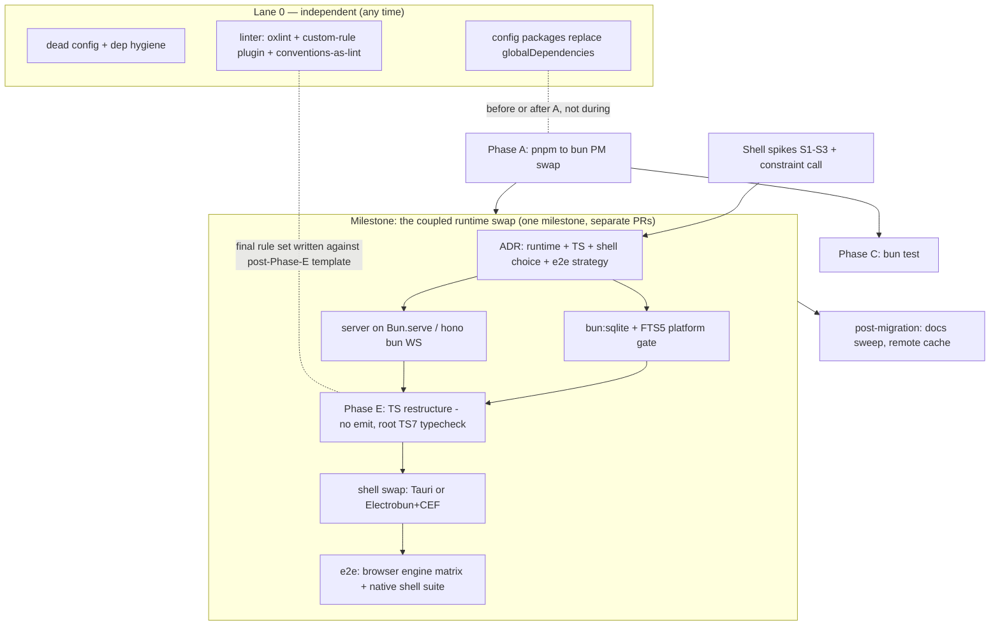

# 06 — Sequencing: the combined roadmap

The one structural fact that dictates everything: **bun:sqlite does not run under Node, and
the packaged Electron desktop runs the server under Node** (`ELECTRON_RUN_AS_NODE`). So the
db-driver swap, the server runtime swap, and the shell swap form a closed set — decision
0005 priced them as one change, and that pricing survives this review. The TypeScript
restructure (the step that _fixes_ the build/typecheck workarounds rather than preserving
them) joins that set: it requires "no Node consumers of the packages", which only becomes
true inside the milestone. Everything else — including the linter modernization and the
meta-test-to-lint-rules move — is independent and runs in parallel lanes.

(Ordering inside the milestone: the TS restructure (B4) can land after the shell (B5) if
shipping the shell sooner matters — the hard edges are ADR-first,
FTS5-gate-before-sqlite-swap, and sqlite+server before the shell. B4-before-B5 is
recommended so the shell's bundle pipeline is written once against the final no-dist
package shape.)

## Stage order with acceptance criteria

| #   | Item                                                                                                                                                                                                                                              | Depends on                                        | Acceptance                                                                                                                                                                                                                                                                                                                                                                                             |
| --- | ------------------------------------------------------------------------------------------------------------------------------------------------------------------------------------------------------------------------------------------------- | ------------------------------------------------- | ------------------------------------------------------------------------------------------------------------------------------------------------------------------------------------------------------------------------------------------------------------------------------------------------------------------------------------------------------------------------------------------------------ |
| 0a  | Dead-config deletions (02 §2.4)                                                                                                                                                                                                                   | —                                                 | verify green                                                                                                                                                                                                                                                                                                                                                                                           |
| 0b  | Dep hygiene: turbo/TS floors, drop drizzle-kit, react dedupe (03 §3.2)                                                                                                                                                                            | —                                                 | verify green                                                                                                                                                                                                                                                                                                                                                                                           |
| 0c  | **Linter modernization** (03 §3.3 + §3.8): shared config package gains the custom plugin (architectural + package.json convention rules); `lint` = `oxlint --type-aware`; micro-ESLint pass for the plugin                                        | 0d recommended first (same package)               | verify green; type-aware findings triaged; both architectural rules proven to fire (fixture test); meta-test checks that became lint rules deleted from the test                                                                                                                                                                                                                                       |
| 0d  | Config packages replace `globalDependencies` (03 §3.1)                                                                                                                                                                                            | not mid-PM-swap                                   | the `--affected` selection measurement re-run and re-documented in turbo.json                                                                                                                                                                                                                                                                                                                          |
| 1   | **Phase A** PM swap pnpm→bun (04 §4.2)                                                                                                                                                                                                            | 0d landed or explicitly deferred                  | clean-machine frozen install; verify; e2e; Windows install job; AppImage packaging still works via prune-based staging; meta-test/lint rules updated                                                                                                                                                                                                                                                   |
| 2   | **Phase C** bun test (04 §4.4)                                                                                                                                                                                                                    | 1                                                 | all suites green under bun test; vitest gone from tree; dev.md updated (separate docs change)                                                                                                                                                                                                                                                                                                          |
| 3   | **Shell spikes S1–S3** (05 §5.0) + operator constraint call                                                                                                                                                                                       | — (can start any time; needs only a served build) | spike results recorded; kill-conditions evaluated; shell chosen                                                                                                                                                                                                                                                                                                                                        |
| 4   | **ADR**: supersedes 0005(b)(c) — runtime swap, TS restructure, shell choice + constraint posture, e2e strategy (dual-target or CDP), update hosting, signing, platform coverage, release-pause window, Playwright-under-Bun re-evaluation trigger | 3                                                 | ADR merged per `docs/decisions/README.md` house style                                                                                                                                                                                                                                                                                                                                                  |
| 5   | **FTS5 platform gate** (04 §4.3)                                                                                                                                                                                                                  | 1                                                 | fts5/snippet/bm25 probe green on ubuntu/macos/windows CI                                                                                                                                                                                                                                                                                                                                               |
| 6   | **bun:sqlite swap** (04 §4.3)                                                                                                                                                                                                                     | 4, 5                                              | db test suite + migration tests green under Bun; raw-API audit complete; pragmas preserved                                                                                                                                                                                                                                                                                                             |
| 7   | **Server on Bun** (04 §4.5)                                                                                                                                                                                                                       | 4; pairs with 6                                   | integration suites green (WS routes especially); plugin-host real-worker tests green under Bun; dev watch works                                                                                                                                                                                                                                                                                        |
| 8   | **Phase E: TS restructure** (04 §4.1, §4.6)                                                                                                                                                                                                       | 6, 7                                              | no library `build` scripts remain; single-target `.ts` exports; root TS 7 `//#typecheck` is the gate (diagnostics-parity diff vs 5.9 recorded); deliberate type errors in package _and_ test code both fail it; `test` no longer depends on `^build`; #118 workaround + comments retired with reasons; oxlint `--type-aware` re-verified against the root tsconfig; cold/warm typecheck times recorded |
| 9   | **Shell swap** (05 §5.A or §5.B per the ADR)                                                                                                                                                                                                      | 8 recommended (hard: 6, 7)                        | packaged app on all three OSes launches, serves canvas, spawns session-host binary; updater dry-run against static host; electron/electron-builder/staging scripts deleted                                                                                                                                                                                                                             |
| 10  | **E2E promotion** (07 §7.2): canvas engine matrix (`webkit`/`firefox` on main/nightly) + native shell suite (WDIO service or CDP per shell)                                                                                                       | 9                                                 | matrix green; per-OS shell smoke (window, canvas node, drag/wheel) green on the packaging matrix                                                                                                                                                                                                                                                                                                       |
| 11  | Docs sweep: AGENTS stack table, development.md, deployment.md, CONTRIBUTING (+ Rust prereqs if Tauri)                                                                                                                                             | 9                                                 | each its own docs PR (repo rule: never a rider)                                                                                                                                                                                                                                                                                                                                                        |
| 12  | Remote cache evaluation (03 §3.5)                                                                                                                                                                                                                 | 9 (matrix exists)                                 | cache hit rates measured before/after                                                                                                                                                                                                                                                                                                                                                                  |

Steps 6–9 land as separate PRs inside one tracked milestone; between step 6 landing and
step 9, **packaged desktop releases are paused** (dev-mode desktop keeps working — it can
spawn host-installed `bun`). If a release must ship in that window, cut it from the last
pre-swap tag. Say this in the ADR so it is a decision, not an accident.

## Standing constraints for every stage (the invariants checklist)

Collected from `AGENTS.md`, the decision records, and `docs/development.md` — every PR in
this program gets judged against these:

1. **Enforcement moves first.** Each stage updates the convention enforcement — the
   meta-test today, its lint-rule successor after 0c — to the _new_ template, then makes
   packages conform. If the enforcement doesn't fail at the start of a stage, the stage
   isn't changing conventions.
2. **The six change-shapes and their proofs** (`docs/development.md`) survive: schema,
   predicate, route, tool, UI, plugin tests keep running and keep meaning the same things.
3. **Green verify is not proof** — every stage names its smoke: run the server, load the
   canvas, package the app, run the updater dry-run.
4. **Session-runtime seam** (decision 0001): core-owned observation/phases/accounting
   semantics untouched by any of this; `spike.yml` keeps running against the compiled
   binary.
5. **The renderer is one web app** — no per-shell forks. Under a Tauri shell this is
   preserved by _not using_ the webview bridge for product features (05 §5.B.1); under
   Electrobun, 0006 proved zero renderer changes.
6. **Single-origin serving** (spec §12) — server serves the renderer; the shell window
   points at it.
7. **`compile` stays uncached** (a smoke run is never cache-replayable). The
   typecheck-depends-on-own-build ordering stays **until step 8 removes its reason** —
   then it is deleted _with_ its `turbo.json` justification, not despite it.
8. **Design gate** (0002): the toolkit Vite/Tailwind build and `checkThemeCss` gate are
   untouched by all phases (toolkit's no-runtime-emit shape is the _model_ for step 8's
   end state, not a victim of it).
9. **Docs edits are their own changes** — never the price of a tooling PR; contradictions
   discovered mid-stage go to the tracker.
10. **Decision records:** the ADR lands before the coupled milestone; measurements (spike
    results, FTS5 probe, TS 7 parity diff, typecheck timings, engine-matrix findings) get
    recorded in it or as amendments, per `docs/decisions/README.md` house style.

## Suggested tracker shape

One epic per lane: `tooling: core cleanups` (0a–0d, 0c), `tooling: bun toolchain` (1–2),
`desktop: runtime + typescript + shell` (3–11 — the spikes, ADR, coupled milestone, and
its docs), `tooling: post-migration` (12). Items map 1:1 to the table rows; each carries
its acceptance row as the definition of done. File via `skill://plotroom-tracker`
conventions; nothing in this folder is tracked state.
