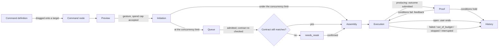

# PlotRoom — Run Lifecycle

**Scope.** How a command node becomes a run, end to end: preview, initiation,
queue admission, assembly, execution, proof, and history. Grounded in
`packages/core/src/commands.ts`, `apps/server/src/runs/service.ts`,
`apps/server/src/runs/queue.ts`, `packages/db/src/run-store.ts`,
`packages/db/src/run-queue-store.ts`, `apps/server/src/config.ts`, and
`apps/server/src/conditions/registry.ts` — detailing spec §3.5, §4.1, §4.4,
and §4.5. What a session does once it is running — phases, delegation,
transcripts, end-state semantics at the session level — belongs to
[session-lifecycle.md](session-lifecycle.md); this document only covers a
run's own record and its own end state. Budget predicates and how a spend cap
is actually enforced against a workstream or global ceiling belong to
[enforcement.md](enforcement.md); this document covers only where a cap is
stated and accepted. Address grammar, versioning, and retention as a general
mechanism belong to [data-model.md](data-model.md); this document covers only
the run-history-specific instance of each.

---

## 1. Command definitions and command nodes

A **command definition** is reusable, editable content, not code: an
`instruction`, a `model` choice, `permissions`, `askPoints`, a `lifecycle`, an
`outcome` (or `null`), `parameters`, and a content `budget`
(`CommandDefinition`, `packages/core/src/commands.ts`). It is created,
duplicated, and organized by the user, shipped first-party in the box, or
shipped inside a plugin (`source: "builtin" | "user" | "plugin"`).

A **command node** (`CommandNode`) is an instance of a definition on the
graph — a definition ID plus its wiring, inside exactly one workstream; a
command never leaves the workstream that holds it.

**Parameters** are declared on the definition (`CommandParameter`: `name`,
`label`, `type`, `required`, `options`) and bound per node
(`ParameterBinding`). A binding is one of two states, kept as separate
variants so a value can never leak out of a proposal by accident:

- `proposed` — a derived default with no confirmed value, carrying
  `derivedFrom` so the user can judge where it came from.
- `confirmed` — a value and when it was confirmed.

`resolveParameters` is the one place a run's parameter values come from: a
`proposed` binding contributes nothing and is reported back as `unconfirmed`,
alongside any `missing` required parameter with no binding at all. Only when
every parameter is `confirmed` does resolution report `ready: true` with
values — the "a proposal the user confirms, never a guess applied silently"
rule (spec §3.5), enforced here rather than left as a convention.

**Two lifecycles** (`COMMAND_LIFECYCLES = ["producing", "open"]`):

- **Producing** declares an `ExpectedOutcome` — a named, typed object,
  optionally with structure, optionally with `WorldCondition`s: predicates
  checked against the outside world (`pull_request_exists`, `checks_green`).
  A `WorldCondition` is a declaration only (`id`, `predicate`, `description`,
  optional `args`) — the checker that can actually observe it lives in the
  condition registry (§7).
- **Open** declares no outcome (`outcome: null`) and ends when the user ends
  it (§6).

## 2. Preview

`RunStore.plan(commandId)` computes what a run of this command node _would
be_, without writing anything: the ordered, assembled inputs, the assembled
body, its byte and token counts, the content-budget verdict, the resolved
`RunConfiguration` (`null` exactly when a parameter is still a proposal), and
every `RunRefusal` that would block it — collected rather than thrown, in the
order the run path itself checks them, because a preview's job is to say
what's missing. `RunStore.preview()` wraps the plan with a `CostEstimate` and
`runnable: plan.blockers.length === 0`.

**What a preview states:**

- **Content** — the ordered inputs and the exact assembled body a run would
  send, byte for byte (§5 covers how this is assembled).
- **Cost basis and uncertainty** — a `CostEstimate` that names its own basis:
  `"prior-runs"`, priced from this definition's own run history and rendered
  as a range (`"$low–$high based on N prior run(s)"`), or
  `"input-size-only"` when there is none (`"no priced history for this
definition; input size only (about N tokens in)"`) — never a bare number
  that looks like a quote (spec principle 7).
- **Accepted spend cap** — the preview surfaces a suggested cap
  (`spendCap.suggestedMicros`, derived from the estimate) with `accepted:
null` until the operator confirms one; the confirmed cap is recorded on the
  run itself. What actually enforces a cap against a budget scope is
  [enforcement.md](enforcement.md)'s.
- **The contract hash** — a scoped preview computes a hash over the
  configuration, the resolved inputs, and runnability
  (`contractHashOf`, `apps/server/src/runs/queue.ts`) — everything a run
  would execute, deliberately excluding anything the batch itself would
  still produce. This is the value a queued run is later re-checked against
  before it is admitted (§4).

**Refusals caught at preview.** `RunRefusal` is one vocabulary
(`packages/db/src/run-store.ts`): `command_deleted`, `parameters_unconfirmed`,
`blocked_input`, `content_budget`, `out_of_budget`, `already_ended`,
`initiation_key_reused`, `initiation_in_flight` — plus `empty_scope` at the
batch level (§3) when a scoped gesture like re-run-all-drifted finds nothing
to run. The preview reports every one that applies; `RunStore.start` reads
the identical plan and refuses on the first, so a preview that says a run is
ready cannot be contradicted by the run itself refusing.

**Open direction: un-credentialed models.** Today, a run whose model no
credential can satisfy is _not_ refused here — it is discovered only after
the workspace is provisioned and the sidecar runtime is spawned
(`apps/session-host/src/main.ts`), which the run then reports as a plain
runtime failure. [#145](https://github.com/plotroom/plotroom/issues/145) (part
of [#135](https://github.com/plotroom/plotroom/issues/135)) tracks adding a
`model_unavailable` refusal to this same vocabulary and collecting it in
`RunStore.plan`, so an un-credentialed model is refused at the preview, before
anything is paid for — the direction, not yet the behavior.

## 3. Initiation

**Idempotency keys.** Every initiating gesture carries a client-supplied
`initiationKey`, and `RunStore.claimInitiation` is the enforcement of
principle 9 — one gesture, one thing — across retries and reconnects. A key
is compared on three axes at once: the command (or `null` for a run-less
gesture), the `InitiationKind` (`run`, `resume`, `fork`, `handoff` — the
latter three each produce a session and no run of their own, §6), and a
`subjectId` where one applies. Claiming a key answers exactly one of three
ways:

- **claimed** — new key, now reserved.
- **settled** — the key already produced its result; a retry is handed back
  the same run and session rather than starting a second one.
- **in_flight** — the first attempt hasn't settled yet; a second attempt on
  the same key is refused (`initiation_in_flight`) rather than racing it.

A gesture that fails before producing anything releases its key
(`releaseInitiation`) rather than burning it forever; a process restart
reclaims any key left unsettled by a crash (`releaseUnsettledInitiations`) —
no attempt can genuinely still be "in flight" once the process that was
making it is gone.

At the batch layer (`apps/server/src/runs/queue.ts`), one `initiationKey`
names the whole scoped gesture (`run_batches.initiation_key`,
`run_queue.initiation_key`, both unique) — retrying the same batch key
replays the existing batch and its entries rather than starting a second
one. Where a scope enqueues multiple commands, each command's own queue entry
derives its key from the batch key (`` `${initiationKey}:${commandId}` ``), so
one gesture is still traceable to one key per thing it produced.

**Batch scopes.** A `RunScopeKind` is one of `one`, `subgraph`, `missing`,
`drifted-workstream`, `drifted-fleet` (spec §4.1's run one / run subgraph /
run what's missing / re-run all drifted), resolved by `resolveScope`:

- **Run one** — the target command, alone.
- **Run subgraph** — the target plus everything downstream that becomes
  runnable, walked breadth-first over dependents and ordered by dependency.
- **Run what's missing** — walked breadth-first over dependencies upstream of
  a blocked target, plus the target itself.
- **Re-run all drifted** — every drifted command in a workstream or
  fleet-wide, each carrying its own reason
  (`` `drifted: N inputs changed since this last ran (ids)` ``).

A scope that resolves to nothing runnable refuses rather than starting an
empty batch: `empty_scope`, `"nothing in this scope is runnable right now;
re-run all drifted runs nothing when nothing has drifted (§4.1)"`.

**Pause-on-failure vs. stop-aborts.** A subgraph (or any multi-entry) batch
**pauses** the moment one of its runs ends `failed` or `out_of_budget`: the
batch moves to `paused` with a reason naming the ending run
(`` `a run in this batch ended as ${kind}; address it and resume (§4.1)` ``),
and every queued entry pauses with it — resumable once the human addresses
it. A user **stop aborts** the remainder instead: the batch moves to
`aborted` (`"a run in this batch was stopped; stopped means stopped
(§4.1)"`), and every queued, paused, or `needs_reask` entry is cancelled —
stopped means stopped, never resumable.

## 4. Queue admission

Initiation beyond the concurrency limit **queues** rather than blocking the
gesture: the gesture already happened, and the system only decides _when_
(spec §4.1). A queued entry (`toQueuedRun`) exposes its batch, command,
workstream, `position`, `state`, `contractHash`, accepted spend cap, and — once
it has one — its run and session.

- **Visible position.** Waiting entries are ordered by when they were
  enqueued, then by their position within their own batch, and mapped to a
  1-based position a human reads directly; a run admitted immediately (under
  the limit) reports no queue position at all.
- **Cancel.** A queued, `needs_reask`, or `paused` entry can be cancelled
  before it starts; anything already started refuses cancellation
  (`already_started`, `"this run is ${state}; a queued run is cancellable
before it starts, and stopping a started one is a stop (§6.7)"`) — stopping
  a started run is `§6.7`'s stop, a different gesture. A cancellation settles
  the entry (`"cancelled before it started"`) and immediately drains the
  freed slot into the next waiting entry.
- **Drifted inputs → `needs_reask`.** Admission recomputes the run's plan and
  its contract hash at the moment a slot opens, not when it was queued. A
  hash that no longer matches what was previewed does not run the new
  inputs silently: the entry becomes `needs_reask`, carrying a description of
  exactly what changed (an input added, a new version, changed content, a
  removal, a reorder, a change in runnability, or a changed configuration).
  Confirming a `needs_reask` entry re-previews it, replaces its stored
  contract, and returns it to `queued` (or leaves it `paused` if its batch is
  paused) — the preview's contract is the promise (spec §4.1: "a queued run
  executes exactly what it previewed, and if its inputs drifted while it
  waited, it says so"), and confirmation is how the promise is renewed rather
  than silently broken.
- **Concurrency.** The global limit defaults to 4
  (`DEFAULT_CONCURRENCY_LIMIT`, `apps/server/src/config.ts`), overridable via
  `PLOTROOM_CONCURRENCY_LIMIT` or a config override, validated as a whole
  number of at least 1. It is held as live, mutable state on the running
  queue service rather than a boot-time constant, and is wired into the
  settings catalog as an operator control that applies without a restart.
  **Raising it drains immediately** — the queue starts admitting waiting
  entries into the newly opened slots as soon as the new limit is set.
  **Lowering it is non-retroactive** — it only affects future admissions;
  sessions already running are never stopped to bring the count down.

## 5. Assembly

Assembly (`RunStore`'s private `assemble`) builds the ordered inputs a run
will actually see, and is shared verbatim between the preview and the run
itself — one method, so "what the preview showed" and "what got recorded"
are the same computation run twice, not two computations that could drift
apart.

- **Ordered context edges.** `graph.contextInputs(commandNodeId)` returns a
  command node's wired inputs in edge order — the same order a human
  rearranges by drag (spec §3.5) — and each is resolved to its current object
  content, or, if it names an unbound output placeholder, to nothing: an
  unresolved input blocks the run and names what it's waiting on
  (`blocked_input`, `"an input has not been produced yet; this command is
blocked on ${refId}"`) rather than being silently skipped.
- **Standing-instruction opt-ins.** A workstream's live standing-instruction
  opt-ins (spec §3.8) resolve first, ahead of every wired input — they are
  the frame the rest of the inputs are read in, not one input among them.
  Which ones, and in what order, is decided once by
  `resolveStandingInstructions`, so two runs of one command with the same
  opt-ins assemble identically. A standing instruction occupies a run-input
  slot with no node ID (it entered through the workstream's opt-in, not a
  drawn edge), but it is recorded on the run exactly like a wired input —
  what a run actually saw is on the record whether or not an edge caused it.
  (The definition's own instruction and confirmed parameters are placed
  ahead of _all_ of this by `assembleRunBody`, the one place that ordering is
  decided.)
- **Content budget: warn or refuse, never truncate.** Each command carries a
  `ContentBudget` (`modelWindowTokens`, `warnAtFraction`, an opt-in
  `hardCapTokens`; the shipped default is a 200,000-token window with a 0.85
  warn fraction and no hard cap). `checkContentBudget` has exactly three
  answers — `ok`, `warn` (assembly proceeds, with a message that content is
  close to the model's window), or `refused` (over an explicit hard cap,
  message included) — and deliberately no fourth answer that truncates
  anything (spec principle 12).
- **Exact recording.** Starting a run (`RunStore.start`) stores, in one
  transaction: the whole assembled body as a content-addressed blob with its
  SHA-256 hash and byte count; the full `RunConfiguration` the definition
  actually ran under (`instruction`, `model`, `permissions`, effective
  `askPoints`, `lifecycle`, `outcome`, confirmed `parameters`, `budget`) as
  the run's own configuration record; and one `run_inputs` row per assembled
  part, each with its ordinal, object, version, content hash, and byte count
  — and every consumed version is marked run-referenced so retention can
  never reclaim it while this run exists to reference it. This is what makes
  a run comparable for as long as it's retained (§8).

## 6. Execution and end states

A run starts in `running` and launches a session under the recorded
configuration's model, effort, and tool permissions. If the runtime itself
cannot start, the run fails immediately
(`` `the runtime would not start: ${message}` ``) and its initiation key is
released so the same gesture can retry cleanly.

A run's end state is a run-level status —
`running | completed | failed | out_of_budget | stopped | interrupted` — and
it is always derived from, never independent of, the session executing it:
completing, failing, running out of budget, being stopped, and being
interrupted by a crash are first session-level outcomes (spec principle 11),
and the run simply records the same word. See
[session-lifecycle.md](session-lifecycle.md) for what each of those means at
the session level — phases, delegation, and how a session itself distinguishes
"it did not work" from "it was stopped" from "it ran out of budget." Here,
the distinction matters at the run level for the same reason it matters at
the session level: `out_of_budget` is its own outcome, not a failure, and a
retry must not blindly re-run something the money simply ran out on.

## 7. Proof

Only a producing command's outcome carries this step; an open command simply
ends when the user ends it (§6).

**The condition registry** (`ConditionCheckRegistry`,
`apps/server/src/conditions/registry.ts`) is the seam between a declared
`WorldCondition` and whatever can actually observe it: a checker registers
against a predicate string (`workspace_file_exists`,
`workspace_command_succeeds` ship in the box; a plugin registers its own,
§9.4/§10.1), and can be unregistered when its plugin is disabled.

**Every declared condition is evaluated.** `evaluate()` walks every condition
a submission declares, in order, and produces exactly one
`ConditionEvaluation` per condition — nothing is skipped, and nothing is
inferred for a condition nobody asked about.

**An unknown or throwing checker means "false," never "unproven."** A
predicate with no registered checker evaluates to `holds: false` with
`` `no checker is available for predicate "${predicate}"; nobody checked,
which is not proof` ``; a checker that throws is treated identically, with
the error folded into the same message. Completion is proof, not a claim
(spec principle 3) — the registry never quietly substitutes a passing result
to let a submission through.

**A failed submission returns feedback and the session continues.**
`checkSubmission` (`packages/core/src/commands.ts`) resolves every declared
condition against what was evaluated — a condition with no evaluation at all
gets the same "nobody checked" treatment
(`` `"${description}" was never checked` ``) — and any failing condition
rejects the submission with the failing conditions and a joined feedback
string. The run stays `running`; nothing ends. Every submission attempt is
recorded (`RunStore.recordSubmission`: ordinal, session, timestamp, whether
it was accepted, every evaluation, and the feedback given), so how many tries
a command took, and why, is answerable afterward without re-evaluating
anything. Only an accepted submission produces a `CompletionProof` and ends
the run `completed`.

**Proof is point-in-time.** A `CompletionProof` records what held at the
moment of submission (`provenAt`, the resolved conditions) and is never
re-evaluated into revocation. A condition that held then and regresses later
— a check that was green and later goes red — does not un-prove the
completed work; it surfaces as drift on that now-done work (spec §4.5), and a
human decides what to do about it, exactly as any other drift does.

## 8. History

**Retained runs.** `RunStore.history(commandId)` returns every run of a
command, oldest first by ordinal. Retention follows a `RunRetentionPolicy` —
the last N runs per definition, plus every pinned run, plus every run any
address still resolves to, plus a configurable window — the run-history
instance of the general retention rule in
[data-model.md](data-model.md).

**`output@n` addressing.** An `OutputAddress` names a run's output as
`latest`, by `ordinal`, `pinned`, or by a specific `run`; `latest` is resolved
by ordering over run ordinals at read time, stored nowhere, so a new run
never silently rewrites what an earlier address meant. See
[data-model.md](data-model.md) for the full address grammar this is one
instance of (spec §3.7, §15 invariant 4).

**Pinning** (`RunStore.pin`) is the human's word for "never compact this": it
reaches the run's assembled content and every version it referenced, as
input or as output, so a pinned run — and everything needed to compare it —
outlives the retention window that would otherwise reclaim it.

**Run comparison and cross-run outcomes.** Two runs of the _same_ command
definition can be compared (`compareRuns`; comparing a run with itself or
with a run of a different definition is refused) over their inputs,
configuration, outputs, cost, and whether their assembled content was
byte-identical. Aggregated across every run of one definition
(`RunOutcomeAggregate`), the same history answers how many attempts a
definition typically takes, its end-state histogram, and what it costs —
priced through the same cost estimator the preview itself uses, so a
cross-run number and a pre-run estimate can never disagree on the same
screen.

**Open direction: the recorded configuration should be the runtime's own
account.** What a run records today (`RunConfiguration`, plus the body
PlotRoom itself assembled) is PlotRoom's own description of what it asked
for — not necessarily what the runtime actually sent. The runtime's own
request dump (model, thinking level, service tier, system prompt, wire tool
schemas, and the converted messages actually on the wire) can diverge from
it — an injected block PlotRoom never assembled is exactly that divergence.
[#159](https://github.com/plotroom/plotroom/issues/159) (closed by
[#176](https://github.com/plotroom/plotroom/issues/176)) tracks capturing the
runtime's own dump as the recorded assembled content and configuration, so
the record becomes the runtime's own account of itself rather than
PlotRoom's reconstruction of it — the same single-plan guarantee §2 already
gives the preview and the run on PlotRoom's own side of the seam, extended
across the boundary to the runtime itself.
