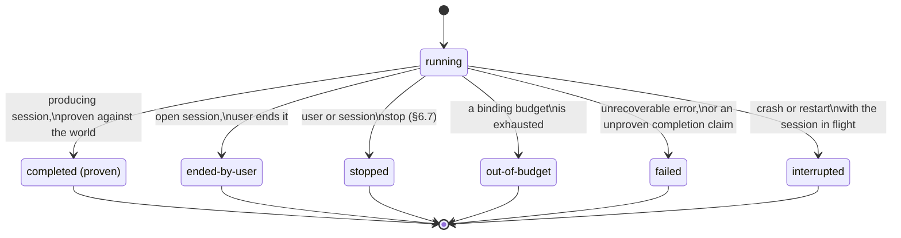

# PlotRoom — Session Lifecycle

**Scope.** This document owns one session from launch to what happens after it
ends: launch choices, the observation/phase derivation, the plan as content,
the interaction surfaces (injection, questions, broadcast), the end-state
taxonomy, and the resume/fork/handoff decisions afterward. It is the model in
`packages/core/src/sessions/`, and where `apps/server/src/routes/` exposes it.
It defers claim mechanics (leases, grants, deadlock) and approval routing to
[enforcement](enforcement.md), the plugin authoring surface to
[plugin-authoring](plugin-authoring.md), and the wire protocol these routes
speak to [interface-contract](interface-contract.md). It details spec §3.6
(sessions), §4.3 (continue or fresh), §6.3–§6.7 (working with sessions), and
§3.2's checkpoint/versioning rule as it applies to the transcript and plan.

---

## 1. Launch

A session is launched into a workstream with a fixed set of choices, recorded
so they are visible for the life of the session and after (spec §3.6):
`SessionLaunchChoices` in `packages/core/src/sessions/runtime.ts` holds
`model`, `effort`, and `toolPermissions`.

- **`model`** — a concrete model identity. A command definition may name a
  role instead ("the planning model"); the role resolves to a concrete model
  at launch, and the concrete model that executed each turn is what gets
  recorded — the role and the executed identity are never interchangeable in
  history (spec §3.5, §15).
- **`effort`** — one of PlotRoom's own `SESSION_EFFORTS`
  (`off | minimal | low | medium | high | max`), a vocabulary adapters map
  onto whatever their own runtime calls the same idea. PlotRoom never speaks a
  vendor's dialect.
- **`toolPermissions`** — a session can be launched narrower than the app's
  own tool set, never wider; `checkToolPermissions` in `runtime.ts` is what
  enforces that, not a document.

**Open direction, recorded rather than silent (spec §3.6; issue [#142](https://github.com/andyhite/plotroom/issues/142)):**
delivery tempo — whether mid-flight input interrupts the work in progress or
waits for the turn to finish — is a per-session launch choice by the spec's
own words, but today it lives only as `RuntimeCapabilities.injection`, an
adapter _declaration_ hard-coded to `"between-turns"`, describing what the
runtime can do rather than recording anyone's decision. The tracked direction
is to fold omp's `steeringMode` / `followUpMode` / `interruptMode` into
`SessionLaunchChoices` itself, in PlotRoom's own vocabulary, so the choice is
made once at launch, overridable per injection (§6.5), and rendered beside
model and effort wherever launch choices appear. Until that lands, every
session silently inherits the adapter's default.

### What the runtime declares about itself

Separate from what a human chose, `RuntimeCapabilities` (`runtime.ts`) is what
an adapter says it can do — PlotRoom emulates or refuses the rest: `fork`
(native support, or PlotRoom emulates by seeding), `injection` (how long
"queued" can last, §6.5), `reportsCost` and `reportsContextWindow` (whether
PlotRoom must price and estimate these itself), and `enforcesPermissions` —
the one capability that is load-bearing rather than informational:
`checkPermissionEnforcement` refuses a runtime that cannot gate tool calls per
call, because approvals and claims would be advice, not enforcement, against
it (decision 0001, C6; claim and approval mechanics are
[enforcement](enforcement.md)'s subject).

---

## 2. Observation model: phases and the plan

Everything the product says about a running session is derived, never
believed. `packages/core/src/sessions/phases.ts` folds the runtime's own
`RuntimeObservation` stream into state PlotRoom computes; nothing in the fold
comes from an agent's claim about itself.

### The observation vocabulary

`RuntimeObservation` (`runtime.ts`) is the single stream everything else is
derived from — timestamped by the adapter at observation time, PlotRoom
computes elapsed time and time-since-last-activity itself:

| Observation                                  | What it means                                                       |
| -------------------------------------------- | ------------------------------------------------------------------- |
| `turn-started` / `turn-ended`                | A turn opened or closed, with `TurnUsage` on close                  |
| `reasoning-delta` / `output-delta`           | Streaming content inside the open turn                              |
| `tool-started` / `tool-finished`             | A tool call in flight                                               |
| `compaction-started` / `compaction-finished` | The runtime is compacting its own context                           |
| `request-raised` / `request-settled`         | A tool-permission or question request opened or closed (§6.4, §6.6) |
| `injection-delivered`                        | Queued input the runtime consumed (§6.5)                            |
| `injection-refused`                          | The runtime rejected input already acknowledged as queued           |
| `session-ended`                              | The runtime's own account of why it stopped                         |
| `runtime-error`                              | A (possibly fatal) runtime error                                    |
| `plan-updated`                               | A fresh snapshot of the runtime's task list (§3.6, §3)              |

`reduceObservation` folds these into a `SessionObservationState` — turn
openness, streaming mode, running tools, open requests, accounting, and the
folded plan. The fold is deliberately total: an observation that says nothing
about the phase still counts as activity, because _silence_, not idleness, is
what health alerts watch (§7.2).

### Phases

`deriveSessionPhase` (`phases.ts`) turns that state into exactly one of ten
`SessionPhase` variants: `thinking`, `responding`, `tool-running`,
`compacting`, `waiting-approval`, `waiting-input`, `waiting-on-claim`,
`stopped`, `failed`, `idle`.

PlotRoom's own gates outrank whatever the runtime is doing: a session waiting
on a claim or an unanswered approval or question reports that phase whatever
it was last seen streaming. Priority order is claim, then approval, then
question, then compaction, then a running tool, then turn state — an ended
session always reports its ended phase first.

**Busy vs. wanting attention.** `phaseFacts` states, once, what each phase
means for the two axes every attention surface reads (§3.6):

| Phase                                          | Busy | Wants attention                                                                          |
| ---------------------------------------------- | ---- | ---------------------------------------------------------------------------------------- |
| thinking, responding, tool-running, compacting | yes  | no                                                                                       |
| waiting-approval, waiting-input                | no   | yes                                                                                      |
| waiting-on-claim                               | no   | **no** — blocked, not asking; only a wait past a threshold becomes a health alert (§7.2) |
| failed                                         | no   | yes                                                                                      |
| stopped, idle                                  | no   | no                                                                                       |

**Silence is health, never phase.** A runtime gone quiet mid-tool-call is
indistinguishable from a hung one from outside the process — claiming either
is inference, not observation. `deriveSessionHealth` reports `silentForMs`
and a `possiblyStalled` flag past a timeout (`DEFAULT_SILENCE_TIMEOUT_MS`,
five minutes) instead of folding that guess into the phase itself.

### The observed-vs-believed line

This is the line the whole module draws, twice, deliberately:

- **Phases and the plan are observation of the runtime** (principle 7). They
  are derived from what the runtime emitted about itself — a fold, not a
  guess — and every surface (canvas, API, agent tool) reads the same
  derivation.
- **World claims are proven, never believed** (principle 3). Whether declared
  work actually got done is a fact checked against the outside world — an
  artifact exists, a pull request is open, checks are green — never an
  agent's own statement that it finished. §5 below is where that line does
  its most visible work: a `completed` end reason with no evidence is
  recorded as a `failed` session that says so, not as a completion nobody
  checked.

---

## 3. The plan

The plan is not a tenth first-class concept — it renders the existing
**Document** concept (spec §3.1) over the same folded state phases come from,
so nothing new needs a producer or a renderer.

### Snapshots and projection

`TodoPhaseSnapshot` / `TodoTaskSnapshot` (`runtime.ts`) mirror omp's own
`todo` tool model: named phases of tasks, each with a status
(`pending | in_progress | completed | abandoned | blocked`) and, when
blocked, a one-line reason. `planRenderings` (`plan.ts`) projects the folded
snapshot three ways — the same three renderings every object on the graph
gets (§3.2): `renderPlanMarkdown` produces one GFM task list per phase
(`- [x] did the thing`, `*(blocked: …)*`) as the agent-ready content; the card
and summary renderings are phase/task counts. The plan is **read and
rendered, never acted on** — no task in it starts anything (principle 2), and
it proves nothing on its own: completion still comes from the world
(principle 3, §5).

### Checkpoint versioning

Like the transcript, the plan does not version on every `plan-updated`
observation — that would bury the drift feed in per-turn noise (§4.5). It
versions on the same checkpoint rule the transcript uses (`checkpoint.ts`, §4
below): when the session ends, or when someone — including the session
itself — explicitly checkpoints. `reconcilePhases` folds a fresh snapshot
over what PlotRoom already knew rather than replacing it outright, because a
resumed session's first snapshot has already had its own completed/abandoned
tasks stripped by the runtime; PlotRoom's log is what remembers them.

### Blocked tasks feed health

A task the runtime reports as `blocked` is a health signal, not silence:
`blockedTasksSince` (`plan.ts`) reads the raw `plan-updated` observations
directly — not the resume-safe folded phases — because a block's _history_
(when the current unbroken streak began, and its current reason) is exactly
what a snapshot-only fold cannot answer. Each `BlockedTask` carries the
phase, the task, its blocker, and the observed moment the block began — never
an inferred one, since inferring a duration nobody reported is exactly what
principle 7 forbids. This is what makes a blocked task surface through the
one health-alert derivation the attention system has, rather than as silence
a human has to notice on their own (spec §3.6, §7.2; direction
[#143](https://github.com/andyhite/plotroom/issues/143) and its children
[#150](https://github.com/andyhite/plotroom/issues/150),
[#152](https://github.com/andyhite/plotroom/issues/152),
[#155](https://github.com/andyhite/plotroom/issues/155),
[#157](https://github.com/andyhite/plotroom/issues/157)). See
[attention-derivation](attention-derivation.md) for the health-alert catalog
itself.

---

## 4. Interaction: injection, questions, and broadcast

### The injection ledger

Content added to a running session mid-flight arrives as a new turn **and**
as permanent content on the graph, wired to the session (spec §6.5,
principle 5). `inject()` resolving is proof the runtime _queued_ the input —
not proof it was consumed. `packages/core/src/sessions/injection.ts` keeps
both states apart, as `InjectionStatus`'s three variants (`"queued"`,
`"delivered"`, `"refused"`), so the UI never pretends a message landed before
it did.

`queueInjection` records the queue acceptance; `markDelivered` records the
observed `injection-delivered` event and only that; `markRefused` records an
`injection-refused` observation — the runtime rejecting input already
acknowledged as queued (a provider error, a disposed session, the SDK
refusing in its current state). Every entry keeps its author and the note it
put on the graph, because injection _is_ authoring (principle 1) and
steering leaves a paper trail by construction, not by convention.

Injection is a peer gesture: humans inject into any session they may author
into, and a session may inject into any _other_ session it may author into —
`checkInjection` delegates to the same lineage predicate every other
authoring act uses (§6.5's "one rule, identical refusals," principle 8), so a
session may not inject into its own initiation chain (principle 1;
[enforcement](enforcement.md) owns the lineage predicate itself).

### Structured questions (`plotroom_ask`)

A session asks the operator a question with selectable options; the answer
returns as a machine-readable result, not prose the model has to interpret
(spec §6.4). `questions.ts` and `apps/session-host/src/ask-tool.ts` enforce
three things structurally, not by convention:

- **Blocking, no timeout.** `plotroom_ask`'s tool call blocks on the request
  bridge until a `respond` command answers it or the session ends — there is
  no timer anywhere in the path.
- **No timed default.** `SessionQuestion` has no `defaultOptionId` and no
  `onTimeout`; the only legal use of a clock on a question is
  `QuestionAttention.onElapsed`, whose type is the single literal
  `"escalate-attention"` — a deadline can only make a question shout louder,
  never answer itself (principle 2). `questions.test.ts` asserts this with
  `@ts-expect-error` cases so the prohibition stays structural rather than a
  rule someone could forget to check.
- **Dismissal is an error.** A dismissed or otherwise unanswered question
  returns `isError: true` to the model — the session learns nothing was
  answered, rather than being handed an unpicked option as if it had been
  chosen.

Options not picked remain visible as **paths not taken** (`pathsNotTaken`),
derived from the question's own option list rather than stored separately,
so it cannot disagree with what was actually offered. `answerQuestion`
refuses a non-human author outright — a session answering its own question
would be principle 1 with extra steps.

### Broadcast

Broadcast delivers the same content to many running sessions at once, and
**who may send one shapes what it is** — two gestures with deliberately
different shapes, in `packages/core/src/sessions/broadcast.ts`:

- **Human broadcast is unconstrained.** A selection, a workstream, or
  everything currently running (`HumanBroadcastTarget`) — no category, no
  rate bound, no lineage check. The operator is the authority the system
  terminates at.
- **Session broadcast names a scope of shared material state, never a
  recipient.** `SessionBroadcastScope` has exactly two variants —
  `everyone-in-repository` and `everyone-in-workspace` — and neither can
  express a chosen list of sessions. `senderSharesScope` requires the sender
  to actually stand in the scope it names, which is what keeps a scope from
  becoming an address: naming a workspace one specific peer occupies would
  otherwise be a recipient list of exactly one.

**The scope rule, not lineage exclusion, closes the collusion channel.** This
is the one place in the product where the lineage rule does not apply — a
session's own ancestors and descendants can legitimately be in scope and
receive the broadcast, on purpose: "excluding the sender's chain would
exclude exactly the sessions most likely affected" (§6.5).

**Mandatory category.** Every session broadcast carries a category from the
closed `SESSION_BROADCAST_CATEGORIES` enum, so it can never masquerade as
ordinary task context: `material-state-changed` ("a rebase, a moved branch, a
schema changed under you") and `shared-resource-warning` ("a port, a lock, a
quota, a service"). The category rides on the content title itself, not only
on the send record, so a reader who finds the note wired into twelve sessions
sees why it exists.

**Rate policy.** Broadcast is the product's largest spend amplifier — one
decision, twelve paid turns — so a session's sends are bounded:
`DEFAULT_SESSION_BROADCAST_POLICY` allows **three broadcasts per hour per
sender**. `planSessionBroadcast` checks the shared-scope requirement _before_
the rate bound, deliberately, so a session probing for a scope it does not
stand in cannot burn its window doing it, and cannot learn from a
`rate_limited` refusal that some scope it named exists. The operator's own
broadcasts are never rate-limited.

**Spend attribution to the sender chain.** A broadcast's induced turns are
charged to the _sender's_ budget chain (`attributeBroadcastSpend`), not to
each recipient's own budget alone — the sender caused the spend, and
anything else would let a session spend from budgets that do not bind it, a
hole in principle 2's transitive guarantee. Every recipient's own ordinary
accounting still charges its own turn; the attribution here fills exactly the
gap that leaves — the sender's ancestors who are not otherwise charged — so
no dollar is billed twice.

The operator always sees a session-originated broadcast: it appears in the
attention queue (`broadcastAttention`) and in each recipient workstream's
activity history (`broadcastActivity`), one entry per recipient workstream.

---

## 5. End states

A session ends in exactly one of six ways — a closed, exhaustive taxonomy
(spec §3.6, principle 11) rather than an open string, so a consumer that adds
a seventh outcome later is a compile error everywhere an end state is
rendered or reasoned about:

Every end state is **resumable** — readable, resumable, forkable, always
(§3.6) — which is why every arrow above leads out of the running state and
none of them leads anywhere but a terminal marker: resuming any of them is a
fresh gesture (§6 below), never a transition the taxonomy itself takes.

### Semantics, stated once

`endStateFacts` (`end-states.ts`) is where every consumer reads what an
outcome means, so "out-of-budget is not failure" is true on every surface
rather than true in one and silently false in the next:

| Kind            | Failed  | Stopped | Proven  | Safe to retry blindly | Wants a decision |
| --------------- | ------- | ------- | ------- | --------------------- | ---------------- |
| `completed`     | no      | no      | **yes** | yes                   | no               |
| `ended-by-user` | no      | no      | no      | yes                   | no               |
| `stopped`       | no      | **yes** | no      | yes                   | no               |
| `out-of-budget` | no      | no      | no      | **no**                | **yes**          |
| `failed`        | **yes** | no      | no      | yes                   | **yes**          |
| `interrupted`   | no      | no      | no      | yes                   | **yes**          |

- **Out-of-budget is not failure.** "The work did not fail; the money ran
  out" (§3.6) — a distinct outcome a human reading the card must be able to
  tell apart from `failed`, and one a retry must not blindly re-run
  (`safeToRetryBlindly: false` is the one place this table says no).
- **Interrupted means crash or restart, not agent behavior.** A crash or a
  server restart catches a session in flight; PlotRoom reports it as
  `interrupted` rather than `failed` or `stopped` because neither of those
  is true — the work did not fail and nobody stopped it (principle 11). The
  runtime never reports this outcome itself; PlotRoom's own recovery path
  supplies it (`EndClassificationContext.interrupted`), the same way
  `out-of-budget` is a PlotRoom-side classification the runtime never
  originates.
- **Only `completed` is proven.** `classifyEnd` is the single place a
  reported `"completed"` reason becomes PlotRoom's record, and it is where
  `checkProvenCompletion` gates it: a reported completion with no
  `CompletionEvidence` — or evidence that fails its world conditions — is
  recorded as `failed`, stating why, rather than as a completion nobody
  checked (principle 3). An **open** session (no declared outcome) can never
  produce a `completed` record at all; there is nothing it could have
  proven, so treating its own "I'm done" as truth would be the least founded
  case of all.

---

## 6. After ending

### Resume vs. fork vs. handoff

Typing into a session is never an implicit continuation — `dispositionOfTypedInput`
(`continuation.ts`) is exhaustive about it: a **live** session takes the text
as an injection (§4 above); an **ended** one has no disposition at all until
somebody names one of three explicit choices (spec §6.3):

- **Resume** — the same session record continues: same id, same workstream,
  same workspace, same accounting, one more turn. `planResume` refuses a
  still-running session (that's injection, not resumption), a deleted one
  (resuming would silently undelete it, contradicting principle 10), and —
  the gate that matters most — a diverged workspace (below).
- **Fork from any point** — a new session with its own workstream and
  workspace, inheriting the conversation up to the chosen turn, so two lines
  of work can diverge from shared understanding. `planFork` (`fork.ts`)
  picks a **native** fork where the adapter's `RuntimeCapabilities.fork`
  reaches the point, or a **seeded** fork otherwise — a fresh native session
  seeded from PlotRoom's own transcript-prefix export — and reports which
  one happened rather than pretending a seeded fork is bit-identical to a
  native one (provider caches and tool state differ). The product also marks
  where a session touched the outside world, because a fork before such a
  point is clean and a fork after it is not (`outside-world.ts`'s
  `ForkCleanliness`).
- **Handoff** — a new session seeded with a **brief**, not the raw history.
  Three parties, one enforced order (`handoff.ts`): the source session
  **drafts** its own brief (or PlotRoom derives one, labelled as derived,
  for a session that never wrote one — an interrupted session, say); a
  human **reviews** it, editing or not; only a `ReviewedHandoffBrief` — a
  type only `reviewHandoffBrief` can produce, and only from a human author —
  can be sent. The brief becomes ordinary graph content, wired into the new
  session with the reviewing human as its author, because the human is who
  decided to send it (principle 5, spec §15-2).

### Transcript-as-content and checkpoint versioning

The transcript is content like anything else — wireable as context, with its
delta being its new turns (spec §3.6). But it does not version on every
turn: `checkpoint.ts`'s rule is that a **live transcript versions on
checkpoint, not on every turn** — a wired transcript that drifted its
consumers per turn would bury the drift feed in noise (§4.5). Its consumers
drift only when the session ends, or when someone — the session included —
explicitly checkpoints it (`session_checkpoint`, or the operator's own
gesture from the conversation panel; both build the identical event,
differing only in author). `previewCheckpoint` reports upfront whether a
checkpoint would publish anything — a checkpoint with nothing pending
publishes nothing, because an empty version would drift every consumer for
no real change. The plan is checkpointed on the same rule (§3 above).

### Drift flags and the continuation gates

Two layers decide whether continuing a session (or a command) is safe, and
they compose rather than duplicate.

**Workspace divergence (§4.3), the coarse layer.** A `WorkspaceFingerprint`
recorded when a session last looked at its workspace is compared against the
workspace's current state (`packages/core/src/workspaces/divergence.ts`).
Seven `DivergenceKind`s can be observed — `history-rewritten`,
`commits-added`, `branch-changed`, `upstream-moved`, `uncommitted-changed`,
`roots-changed`, `unknown` — and `forcesFresh` states, once, which of them
leave a session's mental picture stale in a way no update can repair: all of
them except `upstream-moved` and `uncommitted-changed`. Uncommitted changes
deliberately do not force fresh on their own — the operator is an implicit
claim holder, and staling every session on the first keystroke would be
exactly the failure that guarantee exists to prevent (spec §3.4).
`checkContinuation` is the resulting gate: `{ allowed, blocking, message }`,
consulted by both `planResume` (§6.3) and `compareContinueVsFresh` (§4.3) so
the two surfaces of "continue or start fresh" can never disagree.

**Claim-precise divergence, the fine layer.**
`packages/core/src/claims/divergence.ts` narrows the coarse verdict in both
directions once a complete claim write ledger is available for the interval
being judged — claim mechanics themselves (grants, leases, waitlists,
deadlock detection) are [enforcement](enforcement.md)'s subject; what
matters here is what the ledger buys continuation:

- `commits-added` **stops forcing fresh** once every write in the interval
  is attributed to a claim holder — the ledger can say precisely what
  changed and by whom, rather than falling back to "the workspace changed
  somehow."
- A **hand edit** that the coarse layer would have let through (because
  `uncommitted-changed` alone never forces fresh) **starts blocking** if it
  touched a path this specific session read — `deriveClaimStaleReads` finds
  exactly those reads a different holder's write has invalidated, whether
  the writer was a peer session (`peer-write`) or the operator editing by
  hand (`hand-edit`).

`checkClaimContinuation` returns `ClaimContinuationGate`, which extends the
coarse gate with `staleReads` and a `precise` flag: `precise: false` means
the ledger did not cover the whole interval, so the conservative coarse
verdict stands rather than being narrowed on an incomplete record —
inferring safety from a gap in the log is exactly what principle 7 forbids.

### Window-fit and divergence-forces-fresh, together

Two things gate continuation regardless of operator preference (spec §4.3),
and `compareContinueVsFresh` (`continuation.ts`) checks both before it
recommends anything:

1. **Window fit.** `checkWindowFit` requires the combined content — the
   session's history plus what changed since, for a completed session; just
   what changed since, for a live one — to fit the model's context window
   with **20% headroom** (`DEFAULT_CONTINUE_HEADROOM_FRACTION`), enough for
   a real turn's reasoning and tool output on top of what continuation
   brings back.
2. **Divergence forces fresh.** The `checkContinuation` verdict above,
   applied to the same comparison.

`ContinueVsFresh` always describes _both_ options, the refused one included
with its reason — a preview that hid the option it rejected could not be
argued with. `forcedFresh` is true only when continuation is impossible
whatever the operator prefers; short of that, `recommended` follows the
command's own declared default (`fresh`, unless overridden) — a default
never quietly overrides a hard gate.

### Where this surfaces server-side

`apps/server/src/app.ts` mounts the HTTP surface for all of the above:

| Route file               | Session-lifecycle surface                                                                               |
| ------------------------ | ------------------------------------------------------------------------------------------------------- |
| `routes/sessions.ts`     | list/get, observations, timeline, transcript, stop, end, checkpoint, delete/restore                     |
| `routes/steering.ts`     | inject, questions (raise/list/answer), broadcasts, broadcast-world, stop previews and batches           |
| `routes/continuation.ts` | resume, fork-preview, fork, handoff-brief (draft/review), handoffs, a command's continuation comparison |
| `routes/snapshot.ts`     | a point-in-time read across everything above                                                            |

Backing services registered in `configureApp`: `ContinuationService`
(`apps/server/src/sessions/continuation.ts`) and `SteeringService`
(`apps/server/src/sessions/steering.ts`) hold the resume/fork/handoff and
injection/question/broadcast flows respectively; `SessionHub`
(`apps/server/src/sessions/hub.ts`) and `createSessionGate`
(`apps/server/src/sessions/gate.ts`) are the runtime-adapter and
permission-gate seams these services and routes sit on top of. Claim
enforcement and approval routing that these flows depend on — path claims,
pre-grants, destructive-gesture approvals — are covered in
[enforcement](enforcement.md), not here. The wire shape of these routes
(actor header, refusal envelope, event stream) is
[interface-contract](interface-contract.md)'s subject.
